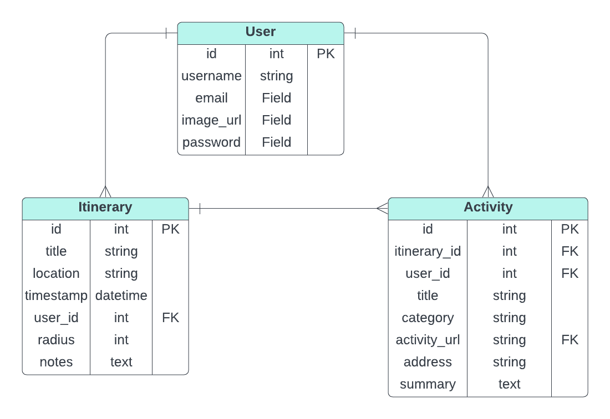

# capstone-project-1

Spontinerary is a web application used to generate random itineraries based on a user's input of what category of activity they would like. 

Check it out here: https://spontinerary.onrender.com

Users can create a personalized itineraries by specifying the location of their itinerary and how far they are willing to travel. The app uses the Google Maps API to help users select the location. Once the user creates an itinerary, they can add activities based on the categories they choose. The app uses Google Places API to fetch a random place based on the user's  preference and location. The user is able to store multiple itineraries with different activities, allowing multiple plans. The website is designed for users to try random places and activities that they would not have known about otherwise.

##App features include:
-Multiple users, allowing personalized itineraries and easy access.
-Creating personalized itineraries, which the user enters the location they want their itinerary to be at and the radius they are willing to travel
-Adding activities to itineraries, which is done by selecting a category. A random place is picked from the Google Places API response and added as an activity to the itinerary. 
-The activity will give a description (if found from the Google API), link, and address of the location
-Viewing all user's activities
-Deletion of the user's itinerary and/or activities 

##Entity Relationship Diagram:

###Installation Instructions:
Prerequisites:
-Flask
-Python 3.8+
-A Google Maps API key
-Supabase database url (optional if running locally)
-Postgres

1. Clone the repository by entering the following in your terminal:
git clone https://github.com/equach18/capstone-project-1.git
2. Navigate to the project directory and install the required packages:
pip install -r requirements.txt
3. Set up the environment variables in an .env folder. It should contain:
-GOOGLE_MAPS_API_KEY
-SECRET_KEY
-SUPABASE_DB_URL
Note: SUPABASE_DB_URL is not required if running locally. However, a database named spontinerary must exist locally.
4. Change the following lines in app.py
from .models import connect_db, db, User, Itinerary, Activity
from .forms import UserAddForm, LoginForm 
to:
from models import connect_db, db, User, Itinerary, Activity
from forms import UserAddForm, LoginForm
The '.' were added to support the launch of the website on Render and needs to be changed in order to run locally.
5. Seed the database: 
python3 seed.py
6. Run the application in your terminal:
Production mode:
flask run
-or-
Devlopment mode: 
FLASK_DEBUG=1 flask run

##Testing:
Unit tests are located under the tests file. In order to run the tests, configure the SQLALCHEMY_DATABASE_URI to 'postgresql:///spontinerary' in app.py. The variable BASE_URL in static/itinerary.js should be also changed to "http://127.0.0.1:5000" before running the tests. To run each test file, copy and paste the commented out line located in the beginning of of the test file into the terminal.

##Resources:
-Bootstrap
-w3schools

##APIs:
-Google Maps API
-Google Places API 

##Technology:
-Python 3.12.3
-Flask-SQLAlchemy
-JavaScript
-CSS
-Postgres
-WTForms
-Supabase
-Render
-python-google-maps (https://github.com/slimkrazy/python-google-places)

##Contribution:
Thank you for your interest in contributing to Spontinerary! Contributions from people like you help create a better software experience for everyone involved. I welcome contributions in various forms, and you don’t need to be a developer to contribute!

###Reporting Bugs:
To report a bug, please click on the 'Issues' tab in GitHub and create a new issue if it has not already been created. Include a description of the issue and the steps to reproduce it. Please add any screenshots if possible. 

###Submitting Changes:
1. Fork the repository and clone your fork.
2. Create a new branch.
3. Make your changes.
4. Commit your changes
5. Push to the branch.
6. Create a new Pull Request targeting the main branch of the original repository.

##Contact Information:
Elaine Quach
email: equach18@gmail.com
Linkedin: https://www.linkedin.com/in/elaine-quach-957735136/
